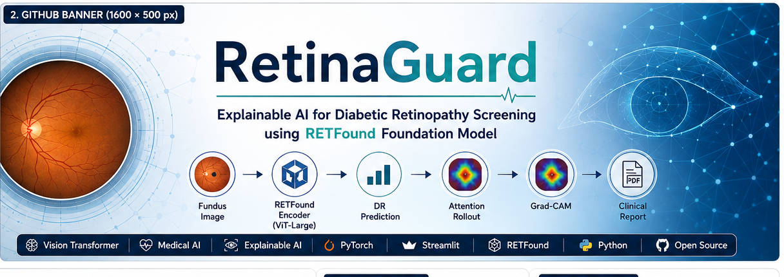
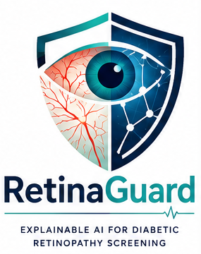
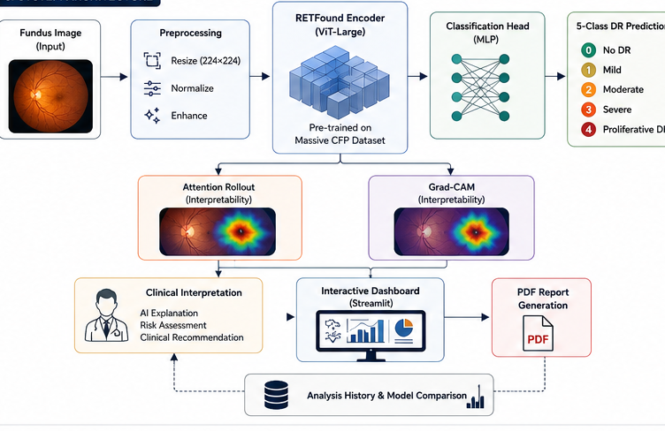
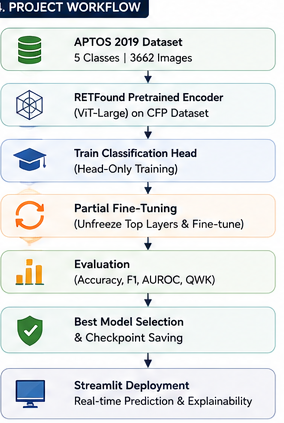

<p align="center">
  
</p>
<h1 align="center">👁️RetinaGuard AI</h1>                                   
<p align="center">
  
</p>

## 🚀 Live Demo

**RetinaGuard AI:**  
https://retinaguard-ai-mpkxjja4wztkcbqpsrmhch.streamlit.app/
<p align="center">
<b>Explainable AI for Diabetic Retinopathy Screening using the RETFound Foundation Model</b>
</p>
<p align="center">


</p>
> **Explainable AI for Diabetic Retinopathy Screening using the RETFound
> Foundation Model**

RetinaGuard AI is an end-to-end retinal image analysis platform built on
the **RETFound** retinal foundation model. It classifies retinal fundus
photographs into **five diabetic retinopathy severity grades** while
providing **Attention Rollout** and **ViT Grad-CAM** visual
explanations. The project also includes an interactive **Streamlit
dashboard**, **clinical-style PDF reports**, **analysis history**, and
**model comparison** tools.

------------------------------------------------------------------------

## Features

-   RETFound (ViT-Large) foundation model
-   Five-class diabetic retinopathy grading
-   Attention Rollout explainability
-   ViT Grad-CAM explainability
-   Streamlit dashboard
-   PDF clinical report generation
-   Analysis history tracking
-   Model comparison dashboard
-   Modular project structure
## System Architecture

<p align="center">

</p>
------------------------------------------------------------------------

## Model

  Component          Value
  ------------------ --------------------------
  Backbone           RETFound CFP
  Architecture       Vision Transformer Large
  Input Size         224×224
  Classes            5
  Total Parameters   303,306,757

------------------------------------------------------------------------

## Dataset

**APTOS 2019 Blindness Detection**

         Split   Images
  ------------ --------
         Train     2930
    Validation      366
          Test      366

Classes:

-   No DR
-   Mild DR
-   Moderate DR
-   Severe DR
-   Proliferative DR
## Workflow

<p align="center">

</p>
------------------------------------------------------------------------

## Training Strategy

### Experiment 1 -- Head-only Training

Frozen RETFound encoder with trainable classification head.

**Best Test Results**

  Metric               Value
  ------------- ------------
  Accuracy        **80.05%**
  Macro F1        **0.5415**
  Weighted F1     **0.7699**
  QWK             **0.8748**
  MCC             **0.6857**
  Macro AUROC     **0.9426**

### Experiment 2 -- Partial Fine-tuning

Final transformer block + classification head unfrozen.

------------------------------------------------------------------------

## Explainability

RetinaGuard provides:

-   Attention Rollout
-   ViT Grad-CAM
-   Clinical interpretation panel
-   Downloadable PDF report

------------------------------------------------------------------------

## Streamlit Dashboard

Main capabilities:

-   Upload retinal image
-   Predict DR severity
-   Confidence scores
-   Class probabilities
-   Attention Rollout
-   Grad-CAM
-   PDF report
-   Analysis history
-   Model comparison

Run locally:

``` bash
streamlit run app.py
```

------------------------------------------------------------------------

## Repository Structure

``` text
RetinaGuard_AI/
├── app.py
├── config/
├── models/
├── training/
├── utils/
├── checkpoints/
├── assets/
├── docs/
├── screenshots/
├── reports/
├── uploads/
└── README.md
```

------------------------------------------------------------------------

## Installation

``` bash
git clone https://github.com/YOUR_USERNAME/RetinaGuard_AI.git
cd RetinaGuard_AI

conda create -n retfound python=3.10 -y
conda activate retfound

pip install -r requirements.txt

streamlit run app.py
```

------------------------------------------------------------------------

## Training

``` bash
python training/train_head.py
python training/train_partial.py
```

Evaluation:

``` bash
python training/evaluate.py
python training/evaluate_partial.py
```

------------------------------------------------------------------------

## Technologies

-   Python
-   PyTorch
-   timm
-   Vision Transformer
-   RETFound
-   Streamlit
-   OpenCV
-   NumPy
-   pandas
-   scikit-learn
-   Matplotlib
-   ReportLab

------------------------------------------------------------------------

## Limitations

-   Trained on APTOS 2019 only
-   Mild DR remains challenging because of class imbalance
-   Intended for research and educational use only
-   Not a certified medical device

------------------------------------------------------------------------

## Future Work

-   Multi-disease retinal screening
-   ONNX export
-   TensorRT optimization
-   Cloud deployment
-   Clinical metadata fusion
-   Test-time augmentation
-   Ensemble learning

------------------------------------------------------------------------

## Medical Disclaimer

RetinaGuard AI is a research prototype for educational purposes. It is
**not** a medical device and should not be used as the sole basis for
diagnosis or treatment. Predictions should always be reviewed by a
qualified ophthalmologist.

------------------------------------------------------------------------

## References

1.  RETFound: A Foundation Model for Retinal Images.
2.  APTOS 2019 Blindness Detection Dataset.
3.  Vision Transformer (ViT).
4.  Masked Autoencoders Are Scalable Vision Learners.
5.  Grad-CAM.

------------------------------------------------------------------------

## Author

**Pranshu**

B.Tech -- Computer Science Engineering (Data Science)

------------------------------------------------------------------------

## License

Add an appropriate open-source license (MIT recommended for your own
code; verify compatibility with RETFound and dataset licenses).
